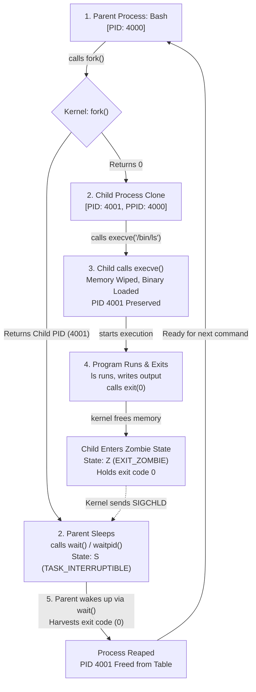

# Day 1: Linux Process Fundamentals & Lifecycle

Personal study notes and terminal labs covering Linux process internals: kernel tracking (`task_struct`), memory isolation, the Bash `fork` + `execve` loop, and PID 1 edge cases in containers.

---

# Part 1: What I Learnt Today

## 1. Programs vs. Processes
* **A program is passive code sitting on disk** (like a `.exe` or an ELF binary). It takes disk space, not RAM or CPU.
* **A process is that code actively running in memory.**
* **Instance is process:** Each running instance of a program is a separate process.
* **One program can spawn multiple processes:** You can run three terminal tabs or five background workers from the exact same binary on disk.
* **Every process gets a unique PID:** The kernel assigns each process its own numeric Process ID.
* **PIDs get recycled:** When a process exits and its parent reaps the exit code, the PID goes back into the kernel's pool to be reused later.

---

## 2. What the Kernel Tracks for Every Process
The Linux kernel tracks each process using an internal structure called `task_struct`:
* **PID & PPID:** Its own Process ID and its parent's Process ID.
* **UID & GID:** User and Group IDs controlling permissions.
* **Virtual Memory:** The private virtual address space mapped for that process.
* **File Descriptors (FDs):** Pointers to open files, standard streams (`0` stdin, `1` stdout, `2` stderr), pipes, and network sockets.

---

## 3. CPU Handling and Memory

### The Scheduler: Traffic Police
* Linux uses the Completely Fair Scheduler (CFS) or **EEVDF** (Earliest Eligible Virtual Deadline First, added in Linux 6.6+) as a traffic cop.
* It decides which process gets CPU time, which core it runs on, and how many milliseconds of slice it gets before yielding so nothing starves.

### Virtual Memory
* **Processes never touch physical RAM directly.**
* The kernel gives each process its own **virtual address space**—an illusion making the process believe it owns the entire memory space.
* The CPU's MMU and kernel page tables translate those virtual addresses to physical RAM locations on the fly.
* Because address spaces are completely isolated, Process A cannot read or corrupt Process B's memory.

---

## 4. Process Creation: `fork()`

Processes don't just appear out of nowhere. When you run a command in Bash:
1. Bash **clones itself** into a parent Bash and child Bash via `fork()`.
2. The parent Bash goes to sleep and waits for the child.
3. The child Bash wipes its memory, loads the command binary into its address space, and runs it via `execve()`.
4. When the program finishes and exits, the parent Bash wakes up, reaps the exit code, and displays the next prompt.

### Two Core Steps
* **`fork()` clones the process:**
  * In the **child**, `fork()` returns `0`.
  * In the **parent**, `fork()` returns the **child's PID** (e.g. `3721`) so the parent knows which process to wait on.
* **`exec()` replaces memory with the new binary:**
  * The child process swaps its memory image with the target program.
  * **The PID stays identical.**

---

## 5. `execve()`

### How It Works
* Wipes the calling process's memory (code, stack, heap) and loads the new binary in place.
* **Does not create a new process:** PID and PPID stay the exact same before and after.
* Code and data get replaced, but **environment variables and open file descriptors stay open** (unless `O_CLOEXEC` was set).

### Return Values
* `execve()` **never returns on success** because the original calling code has literally been wiped from memory. Execution jumps straight into the new binary's entry point.
* It only returns `-1` if it fails (bad path, no permission, etc.).
* When the program finishes, it calls `exit(0)`. That `0` is the exit status code the sleeping parent reaps with `wait()`.

---

## 6. Process Lifecycle Loop

Here is the exact cycle when running a command in a shell:



---

## 7. PID 1

### Role of PID 1
* The first user-space process started by the kernel at boot (`systemd` or `/sbin/init`).
* **Parent of all processes:** The entire system process tree branches off PID 1.
* The kernel treats PID 1 differently from every other process on the box.

### Orphan Adoption & Zombie Prevention
* If a parent process dies or crashes while its child is still running, the child becomes an **orphan**.
* Linux does not kill the child. Instead, the kernel **reparents the orphan to PID 1** (or the nearest registered subreaper).
* **PID 1 reaps orphans:** It runs an active wait loop to harvest orphan exit codes immediately so they don't linger as dead zombies.
* **Immunity:** PID 1 is immune to `kill -9 1`. The kernel intentionally ignores unhandled fatal signals sent to PID 1 to protect the OS from panicking.

---

## 8. Containers and PID 1

Why running apps directly as PID 1 in Docker causes issues:
* **Zombie accumulation:** Apps like Node, Python, or Go don't implement zombie reaping loops. If child workers crash or spawn background processes, those orphans reparent to PID 1. When they exit, they stay `<defunct>` in the process table forever.
* **Host PID exhaustion:** Containers share the host kernel. As zombies pile up, they eat slots in `/proc/sys/kernel/pid_max`. Once full, no new processes can fork anywhere on the host.
* **Ignored signals:** The kernel does not assign default signal handlers to PID 1. If an app doesn't explicitly trap `SIGTERM`, it ignores stop requests until Docker forces a hard `SIGKILL` after 10 seconds.
* **Fix:** Use an init wrapper like `tini`, `dumb-init`, or Docker's `--init` flag to run as PID 1, forward signals, and harvest dead child processes.

---

## 9. Edge Cases: Orphans vs. Zombies & `O_CLOEXEC`

### Orphan vs. Zombie
| Attribute | Orphan Process | Zombie Process (`<defunct>`, State `Z`) |
| :--- | :--- | :--- |
| **Is it alive?** | **Yes.** Actively running code on the CPU. | **No.** Already dead and exited. |
| **Memory** | Has full virtual address space. | Zero memory (code, heap, stack freed). |
| **Parent State** | Biological parent is **dead**. | Parent is **alive**, but hasn't called `wait()`. |
| **Kernel State**| Reparented to PID 1 / subreaper. | Minimal entry in Process Table holding exit code. |
| **Can you kill it?**| Yes, via `kill <PID>`. | **No.** Already dead (`kill -9` does nothing). |

### File Descriptors & `O_CLOEXEC`
* File descriptors stay open across `execve()` by default.
* If a parent process opens sensitive files, sockets, or database handles and calls `execve()` without closing them, the child inherits open access to those descriptors.
* Setting `O_CLOEXEC` on open files ensures the kernel closes them automatically the instant `execve()` runs.

---

# Part 2: What I Did Today (Labs & Verification)

### Lab 1: Inspecting Process Anatomy via `/proc`
Script: [`lab/inspect_proc.sh`](./lab/inspect_proc.sh)

```console
$ ./lab/inspect_proc.sh
==========================================
   PROCESS INSPECTION LAB (PID: 5702)       
==========================================

[1] Command Line (/proc/5702/cmdline):
/bin/bash ./lab/inspect_proc.sh 

[2] Key Process Attributes (/proc/5702/status):
Name:	inspect_proc.sh
State:	S (sleeping)
Pid:	5702
PPid:	5700
Uid:	1000	1000	1000	1000
Gid:	1000	1000	1000	1000
FDSize:	256
VmSize:	    4948 kB
VmRSS:	    3684 kB

[3] Open File Descriptors (/proc/5702/fd):
lr-x------ 1 abir abir 64 Sep 11 03:49 0 -> pipe:[34388]
l-wx------ 1 abir abir 64 Sep 11 03:49 1 -> pipe:[34389]
l-wx------ 1 abir abir 64 Sep 11 03:49 2 -> pipe:[34390]
lr-x------ 1 abir abir 64 Sep 11 03:49 255 -> ./lab/inspect_proc.sh
```

**What this showed:**
- `/proc/<PID>/cmdline` stores arguments separated by null bytes.
- `/proc/<PID>/status` shows biological parent PID (`PPid: 5700`), process state (`S`), and memory usage (`VmSize` vs physical `VmRSS`).
- `/proc/<PID>/fd` reveals file descriptors: `0`, `1`, `2` attached to standard pipes, and `255` referencing the running script itself.

---

### Lab 2: Forking, Child PID Tracking & Orphan Adoption
Scripts: [`lab/orphan_demo.py`](./lab/orphan_demo.py) and [`lab/orphan_demo.sh`](./lab/orphan_demo.sh)

```console
$ python3 lab/orphan_demo.py
=================================================================
[*] [Supervisor: 5718] Starting process lifecycle experiment
=================================================================
[*] [Parent:     5725] Worker Parent running. Calling os.fork() to spawn child...
[+] [Parent:     5725] fork() returned Child PID: 5726
[+] [Parent:     5725] Parent will now EXIT IMMEDIATELY without calling wait().
[+] [Parent:     5725] Child 5726 is now an orphan!
[+] [Child:      5726] Child created! Biological Parent PPID: 5725 ('python3')
[+] [Child:      5726] Waiting for Biological Parent (5725) to terminate...
[*] [Supervisor: 5718] Observed Worker Parent 5725 exit cleanly.
-----------------------------------------------------------------
[!] [Child:      5726] Biological Parent died! Querying kernel for new PPID...
[!] [Child:      5726] Adoptive Parent PPID: 5717
[!] [Child:      5726] Guardian Name: 'Relay(5718)' (PID: 5717)
=================================================================
[*] [Supervisor: 5718] Experiment completed successfully.
```

**What this showed:**
- `fork()` handed the child PID `5726` to the parent, while the child started with biological parent `PPID: 5725`.
- When the worker parent exited without calling `wait()`, the child stayed alive.
- The kernel reparented the running orphan to the nearest active subreaper (`PID 5717`, `Relay`) instead of killing it.

---

### Lab 3: File Descriptor Survival Across `execve()`
Script: [`lab/fd_cloexec_demo.py`](./lab/fd_cloexec_demo.py)

```console
$ python3 lab/fd_cloexec_demo.py
==================================================
   FILE DESCRIPTOR INHERITANCE ACROSS EXECVE()    
==================================================
Parent process PID: 5751
FD 3 -> /tmp/leaked_secret.txt (Inheritable: True)
FD 4 -> /tmp/closed_secret.txt (Inheritable: False)

Calling os.execve() to replace memory with '/bin/ls -l /proc/self/fd'...
total 0
lr-x------ 1 abir abir 64 Sep 11 03:49 0 -> pipe:[38018]
l-wx------ 1 abir abir 64 Sep 11 03:49 1 -> pipe:[38019]
l-wx------ 1 abir abir 64 Sep 11 03:49 2 -> pipe:[38020]
lrwx------ 1 abir abir 64 Sep 11 03:49 3 -> /tmp/leaked_secret.txt
lr-x------ 1 abir abir 64 Sep 11 03:49 4 -> /proc/5751/fd
```

**What this showed:**
- FD 3 survived the `execve()` memory wipe and remained open inside the new `/bin/ls` process.
- FD 4 with `O_CLOEXEC` (`inheritable=False`) was automatically closed by the kernel when `execve()` ran.

---

### Lab 4: Testing PID 1 Immunity to `kill -9`
Testing `SIGKILL` directly against PID 1 as root:

```console
# kill -9 1
# ps -p 1 -o pid,stat,comm
    PID STAT COMMAND
      1 Ss   systemd
```

**What this showed:**
- Even running as root (`UID 0`), `SIGKILL` sent to PID 1 was silently discarded by the kernel. PID 1 stayed alive (state `Ss`).
