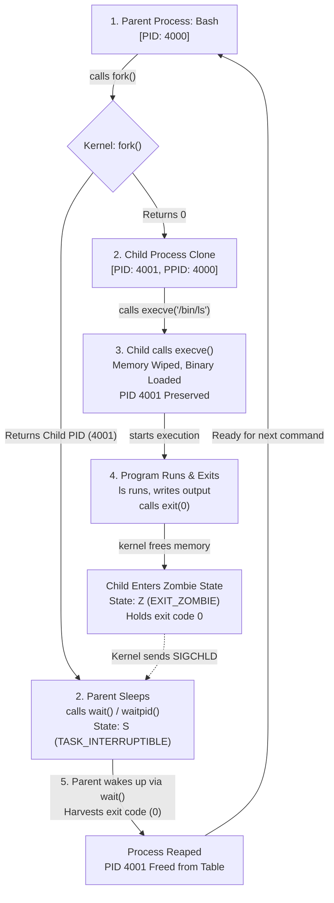

# Day 1: Linux Process Fundamentals & Lifecycle

Personal study notes and terminal labs covering Linux process internals: kernel tracking (`task_struct`), memory isolation, the Bash `fork` + `execve` loop, and PID 1 edge cases in containers.

---

# Part 1: What I Learnt Today

* Programs are executable code and stored disk in a file.
* A process is a live execution.
* 1 program can have multiple processes.
* Each process has a different PID.
* PID can be reused.
* Instance is process.
* Program: .exe
* Kernel tracks for every process:
  * PID & PPID
  * UID, Group ID
  * Virtual memory
  * FD

---

## CPU Handling and Memory

* A completely fair scheduler or EEVDF is like a traffic police. It decides which process gets into the CPU, lands on which core, and how many milliseconds it gets to run. It prioritizes which process to run based on high priority and urgency.
* A process never talks directly to your RAM. Instead, the kernel gives the process its own virtual address space, an illusion making the process believe it has an entire memory to itself.
* The kernel and CPU translate those virtual addresses secretly into physical RAM locations.
* Every single process has its own separate virtual address space.

---

## Process Creation: `fork()`

* A process doesn't come out of thin air.
* When we run a program, the current process (Bash) clones itself into a parent (Bash) and a child (Bash).
* The parent Bash goes into sleep and waits for the child process to finish. The child Bash wipes its Bash brain, loads the command into its memory, and our desired program runs. Then it finishes and exits, and the parent Bash wakes up ready for the next command.

* **`fork`** -> Bash clones itself.
* **`exec`** -> Child process replaces its memory with a new program. PID stays the same.

---

## `execve()`

* What `execve()` does:
  * Wipes the calling process memory and loads a new binary in its place.
  * Does not create a new process.
* Child returns with 0.
* Parent returns value with 3721.
* `exec()` only wipes out code and data, but it will keep environment variables and open file descriptors.

---

## PID 1

* PID 1 is the parent of all processes.
* The kernel treats PID 1 differently from everything else on the system.
* If a parent dies or crashes while its child is still running, that child becomes an orphan.
* Linux doesn't kill the child; instead, it reparents the orphan to PID 1 (or a designated subreaper). PID 1 becomes its new legal guardian.
* PID 1 is immune to `sudo kill -9 1`.
* PID 1 reads orphan exit code immediately so it doesn't get stuck as a zombie.

### What is PID 1?
* The 1st user-space process started by the kernel.

---

## Process Lifecycle Loop



---

# Part 2: What I Did Today (Labs & Verification)

### Lab 1: Inspecting Process Anatomy via `/proc`
Script: [`lab/inspect_proc.sh`](./lab/inspect_proc.sh)

```console
$ ./lab/inspect_proc.sh
==========================================
   PROCESS INSPECTION LAB (PID: 5702)       
==========================================

[1] Command Line (/proc/5702/cmdline):
/bin/bash ./lab/inspect_proc.sh 

[2] Key Process Attributes (/proc/5702/status):
Name:	inspect_proc.sh
State:	S (sleeping)
Pid:	5702
PPid:	5700
Uid:	1000	1000	1000	1000
Gid:	1000	1000	1000	1000
FDSize:	256
VmSize:	    4948 kB
VmRSS:	    3684 kB

[3] Open File Descriptors (/proc/5702/fd):
lr-x------ 1 abir abir 64 Sep 11 03:49 0 -> pipe:[34388]
l-wx------ 1 abir abir 64 Sep 11 03:49 1 -> pipe:[34389]
l-wx------ 1 abir abir 64 Sep 11 03:49 2 -> pipe:[34390]
lr-x------ 1 abir abir 64 Sep 11 03:49 255 -> ./lab/inspect_proc.sh
```

**What this showed:**
- `/proc/<PID>/cmdline` stores arguments separated by null bytes.
- `/proc/<PID>/status` shows biological parent PID (`PPid: 5700`), process state (`S`), and memory usage (`VmSize` vs physical `VmRSS`).
- `/proc/<PID>/fd` reveals file descriptors: `0`, `1`, `2` attached to standard pipes, and `255` referencing the running script itself.

---

### Lab 2: Forking, Child PID Tracking & Orphan Adoption
Scripts: [`lab/orphan_demo.py`](./lab/orphan_demo.py) and [`lab/orphan_demo.sh`](./lab/orphan_demo.sh)

```console
$ python3 lab/orphan_demo.py
=================================================================
[*] [Supervisor: 5718] Starting process lifecycle experiment
=================================================================
[*] [Parent:     5725] Worker Parent running. Calling os.fork() to spawn child...
[+] [Parent:     5725] fork() returned Child PID: 5726
[+] [Parent:     5725] Parent will now EXIT IMMEDIATELY without calling wait().
[+] [Parent:     5725] Child 5726 is now an orphan!
[+] [Child:      5726] Child created! Biological Parent PPID: 5725 ('python3')
[+] [Child:      5726] Waiting for Biological Parent (5725) to terminate...
[*] [Supervisor: 5718] Observed Worker Parent 5725 exit cleanly.
-----------------------------------------------------------------
[!] [Child:      5726] Biological Parent died! Querying kernel for new PPID...
[!] [Child:      5726] Adoptive Parent PPID: 5717
[!] [Child:      5726] Guardian Name: 'Relay(5718)' (PID: 5717)
=================================================================
[*] [Supervisor: 5718] Experiment completed successfully.
```

**What this showed:**
- `fork()` handed the child PID `5726` to the parent, while the child started with biological parent `PPID: 5725`.
- When the worker parent exited without calling `wait()`, the child stayed alive.
- The kernel reparented the running orphan to the nearest active subreaper (`PID 5717`, `Relay`) instead of killing it.

---

### Lab 3: File Descriptor Survival Across `execve()`
Script: [`lab/fd_cloexec_demo.py`](./lab/fd_cloexec_demo.py)

```console
$ python3 lab/fd_cloexec_demo.py
==================================================
   FILE DESCRIPTOR INHERITANCE ACROSS EXECVE()    
==================================================
Parent process PID: 5751
FD 3 -> /tmp/leaked_secret.txt (Inheritable: True)
FD 4 -> /tmp/closed_secret.txt (Inheritable: False)

Calling os.execve() to replace memory with '/bin/ls -l /proc/self/fd'...
total 0
lr-x------ 1 abir abir 64 Sep 11 03:49 0 -> pipe:[38018]
l-wx------ 1 abir abir 64 Sep 11 03:49 1 -> pipe:[38019]
l-wx------ 1 abir abir 64 Sep 11 03:49 2 -> pipe:[38020]
lrwx------ 1 abir abir 64 Sep 11 03:49 3 -> /tmp/leaked_secret.txt
lr-x------ 1 abir abir 64 Sep 11 03:49 4 -> /proc/5751/fd
```

**What this showed:**
- FD 3 survived the `execve()` memory wipe and remained open inside the new `/bin/ls` process.
- FD 4 with `O_CLOEXEC` (`inheritable=False`) was automatically closed by the kernel when `execve()` ran.

---

### Lab 4: Testing PID 1 Immunity to `kill -9`
Testing `SIGKILL` directly against PID 1 as root:

```console
# kill -9 1
# ps -p 1 -o pid,stat,comm
    PID STAT COMMAND
      1 Ss   systemd
```

**What this showed:**
- Even running as root (`UID 0`), `SIGKILL` sent to PID 1 was silently discarded by the kernel. PID 1 stayed alive (state `Ss`).
