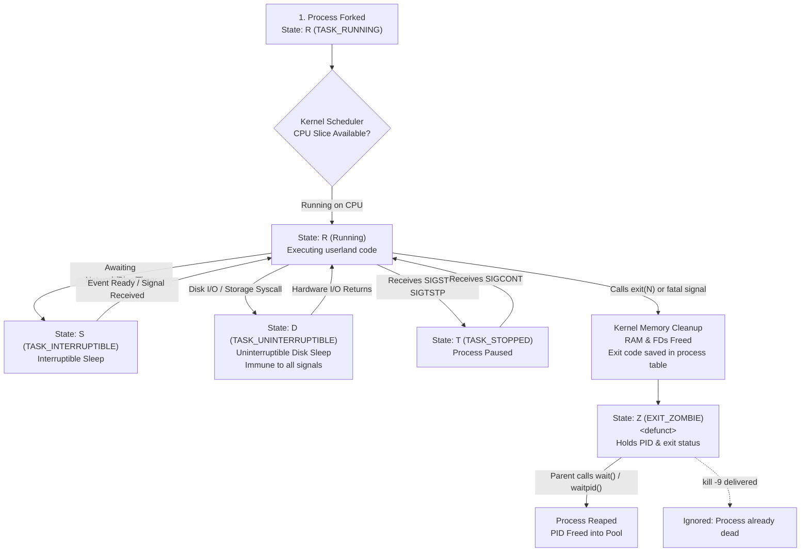

# Day 2: Linux Process Termination, Signals & Lifecycle States

Personal study notes and terminal labs covering Linux process termination mechanics: 8-bit exit code boundaries, parent wait and reaping cycles, zombie process accumulation and PID table exhaustion, signal delivery and handling semantics (catch, ignore, default), process probing via `kill -0`, CFS niceness priority, kernel process states (`R`, `S`, `D`, `Z`, `T`), and `/proc` state inspection.

---

# Part 1: What I Learnt Today

## 1. Exit Status Codes & The 8-Bit Boundary

* **Every terminating process leaves an exit status:** When a process completes execution or crashes, it calls `exit(N)` (or `_exit(N)`). This integer return code informs the operating system and the parent process how execution finished.
* **Status semantics:**
  * `0`: Success / clean execution.
  * `1` to `255`: Failure, errors, or custom application exit codes.
* **The 8-bit constraint:** In Linux, exit codes are strictly 8-bit unsigned integers (`0` to `255`).
  * Only the least significant 8 bits of the integer passed to `exit(N)` are preserved by the kernel (`status & 0xFF`).
  * If a program exits with `256`, the exit code truncates to `0` (`256 % 256 = 0`). A crashed or failing application returning `256` will falsely signal success to shell scripts, orchestrators, and CI/CD pipelines.
  * An exit code of `257` becomes `1`, `300` becomes `44`, and `-1` wraps to `255`.
* **The `$?` shell variable:** In Bash and POSIX shells, the special parameter `$?` stores the exit status of the most recently executed foreground command or pipeline.
* **Signal-induced termination exit codes:** When a process is killed by an unhandled signal, shells adopt the convention of setting `$?` to `128 + signal_number`:
  * Killed by `SIGHUP` (1) -> Exit code `129`
  * Killed by `SIGINT` (2) -> Exit code `130`
  * Killed by `SIGKILL` (9) -> Exit code `137`
  * Killed by `SIGTERM` (15) -> Exit code `143`

---

## 2. Waiting, Reaping, and the Zombie Lifecycle

When a process terminates, the Linux kernel does not instantly vanish its entire record from the operating system:
1. **Memory reclamation:** The kernel immediately tears down the process's private virtual address space, frees its physical RAM pages (`VmRSS`), closes open file descriptors, and releases locks.
2. **Process table entry retained:** The kernel preserves a minimal `task_struct` entry in the system process table. This entry holds the terminated process's PID, exit status code, and resource consumption statistics.
3. **The waiting phase:** The parent process is expected to call `wait()` or `waitpid()` to pause or synchronize until the child state changes.
4. **The reaping phase:** When the parent calls `wait()` or `waitpid()`, the kernel transfers the child's exit status code to the parent and frees the PID and `task_struct` from the process table. The process is now fully reaped and removed.

### What is a Zombie Process?
* **Definition:** A process that has called `exit()`, freed its code and memory, but whose parent has not yet called `wait()` to harvest its exit code.
* **Process state:** Marked as `Z` (`EXIT_ZOMBIE`) in `ps` and `/proc/<PID>/status`, commonly annotated as `<defunct>`.
* **Resource footprint:** Consumes 0 bytes of RAM, 0 bytes of swap, and 0 CPU cycles. However, it holds onto 1 PID and 1 kernel process table slot.
* **Immunity to signals:** You cannot kill a zombie process. Running `kill -9 <PID>` against a zombie does nothing because the process is already dead; there is no userland context or execution thread to receive or handle a signal.
* **Eliminating zombies:** A zombie can only be cleared if:
  1. Its parent wakes up and calls `wait()` / `waitpid()`.
  2. Its parent is terminated. When the parent dies, the kernel reparents the zombie child to PID 1 (or the nearest subreaper), which periodically calls `wait()` to reap defunct children.

---

## 3. Signals: Asynchronous Process Control

Signals are software interrupts delivered by the Linux kernel to a process to notify it of an asynchronous system event or command request.

### Common Signal Sources
* **Keyboard input (terminal driver):**
  * `Ctrl + C` -> `SIGINT` (Signal 2): Requests interrupt/stop. Can be caught for clean shutdown.
  * `Ctrl + Z` -> `SIGTSTP` (Signal 20): Interactive terminal stop request. Suspends the process into the background.
  * `Ctrl + \` -> `SIGQUIT` (Signal 3): Requests termination with a core dump.
* **Kernel events:**
  * `SIGSEGV` (Signal 11): Process attempted an invalid memory access (segmentation fault).
  * `SIGFPE` (Signal 8): Erroneous arithmetic operation (e.g. integer division by zero).
  * `SIGPIPE` (Signal 13): Process attempted to write to a pipe or socket whose read end is closed.
  * `SIGCHLD` (Signal 17): Sent to parent whenever a child process terminates, stops, or resumes.
* **User / Process commands (`kill` command):**
  * `kill <PID>`: Shorthand for `kill -15 <PID>` (`kill -TERM`). Requests orderly shutdown.

---

## 4. Signal Reactions & Uncatchable Signals

When a signal arrives at a process, there are three possible ways it can respond:
1. **Default action (`SIG_DFL`):** The process executes the kernel's built-in default behavior for that signal (most signals terminate the process, some dump core, others are ignored like `SIGCHLD`, and stop signals pause execution).
2. **Ignore (`SIG_IGN`):** The process instructs the kernel to drop the signal on arrival without interrupting userland execution.
3. **Catch (Custom signal handler):** The process registers a custom handler callback function. When the kernel delivers the signal, it saves the process execution context, runs the custom code (e.g. flushing log buffers, closing database connections, removing lockfiles), and either exits or resumes.

### The Two Uncatchable Signals: `SIGKILL` (9) & `SIGSTOP` (19)
* Neither `SIGKILL` nor `SIGSTOP` can be caught, ignored, or blocked.
* The Linux kernel intercept checks for these signals directly inside the kernel scheduler and signal delivery path before control ever returns to user space.
* `SIGKILL` guarantees immediate, unconditional termination. The process cannot run cleanup routines.
* `SIGSTOP` guarantees immediate suspension without userland intervention.

---

## 5. Process Probing with `kill -0`

The `kill` syscall and CLI utility can send Signal 0 (the null signal):
```bash
kill -0 <PID>
```
* **No signal is actually delivered:** Sending signal 0 does not terminate, interrupt, or alter the target process in any way.
* **Validation mechanism:** The kernel performs all standard permission and existence checks:
  * **Success (exit code `0`):** The target PID exists and the calling user has permission to send signals to it.
  * **Failure with `ESRCH` (exit code `1`):** The PID does not exist in the process table.
  * **Failure with `EPERM` (exit code `1`):** The PID exists, but the caller lacks permission to signal it (e.g. an unprivileged user inspecting a process owned by root).
* **Production use:** Ideal for lockfile validation, daemon health probes, and checking background worker liveness without destructive side effects.

---

## 6. Niceness & CPU Scheduling Priority

The Linux kernel scheduler (CFS / EEVDF) determines process CPU time slices based on priority.

* **The Nice scale:** Ranges from `-20` to `19`, with `0` as the default.
  * **High nice value (e.g. `+19`):** Low priority. The process is "nice" to other workloads, yielding CPU cycles.
  * **Low or negative nice value (e.g. `-20`):** High priority. The process aggressively requests CPU time slices.
* **Priority mapping:** In `ps` and `top`, the scheduling priority `PR` relates directly to nice `NI`:
  $$\text{PR} = 20 + \text{NI}$$
  * A default nice of `0` maps to priority `20`.
  * A nice of `19` maps to priority `39`.
  * A nice of `-20` maps to priority `0` (or real-time scheduling).
* **CLI manipulation:**
  * Launching with modified niceness:
    ```bash
    nice -n 10 ./background_worker.sh
    ```
  * Adjusting a running process:
    ```bash
    renice -n 15 -p <PID>
    ```
  * **Privilege rules:** Any user can lower their process priority (increase nice value). Only `root` (or processes with `CAP_SYS_NICE`) can raise priority (decrease nice value or assign negative numbers).

---

## 7. Process States & Kernel Diagnosis

The Linux kernel records process execution status using single-letter state codes in `ps`, `top`, and `/proc/<PID>/status`:

| State Code | Name | Description | SRE Diagnosis |
| :--- | :--- | :--- | :--- |
| **`R`** | Running / Runnable | Actively executing on CPU or sitting in the CFS runqueue ready to execute. | High CPU consumption; normal under active load. |
| **`S`** | Interruptible Sleep | Idle, waiting for an event, timer, socket I/O, or pipe input. Responds immediately to signals. | Healthy baseline state for 95%+ of system daemons. |
| **`D`** | Uninterruptible Sleep (Disk Sleep)| Blocked in a kernel syscall waiting directly on hardware or storage I/O. Does not respond to signals. | **Warning / Incident:** Indication of slow disk, hung NFS mount, corrupted filesystem, or driver deadlock. Cannot be terminated even with `kill -9`. |
| **`T`** | Stopped | Execution paused by a job control signal (`SIGTSTP`, `SIGSTOP`) or debugger (`ptrace`). | Paused process. Resumes when sent `SIGCONT`. |
| **`Z`** | Zombie / Defunct | Dead process that called `exit()`. Waiting for parent to call `wait()`. | **Bug in parent process:** Parent is failing to reap children. Accumulation threatens PID exhaustion. |

---

## 8. `/proc` as the Kernel's State Ledger

* **/proc is a virtual filesystem in RAM:** It takes up 0 bytes of persistent disk storage. It is synthesized on demand by the kernel whenever read.
* **Source of truth:** All process inspection utilities (`ps`, `top`, `htop`, `pidof`, `fuser`, `lsof`) parse `/proc` files under the hood.
* **Key files for termination and state analysis:**
  * `/proc/<PID>/status`: Human-readable summary showing `Name`, `State`, `Tgid`, `Pid`, `PPid`, `FDSize`, memory allocations, and signal masks (`SigBlk`, `SigIgn`, `SigCgt`).
  * `/proc/<PID>/stat`: Raw single-line space-delimited metrics consumed by `ps`. Field 3 is state, field 18 is priority, field 19 is nice value.
  * `/proc/<PID>/wchan`: Name of the specific kernel wait channel / function where a sleeping (`S`) or uninterruptible (`D`) process is currently blocked.

---

## 9. Process Termination & State Transitions

The diagram below maps how a process transitions across kernel states through signals, hardware waits, termination, and parent reaping:



---

## 10. Production / SRE Gotchas & Edge Cases

### Gotcha 1: The Exit 256 Rollover Bug Masking Failures
Because exit codes are truncated to 8 bits (`status & 0xFF`), calling `exit(256)` results in an exit code of `0`.
* In bash scripts or CI/CD pipelines relying on `set -e` or `if my_command; then ...`, a failure that returns `256` will report success.
* **Fix:** Always ensure application exit codes reside strictly between `1` and `255`.

### Gotcha 2: Zombie Storms & PID Exhaustion
Zombies consume no memory, leading engineers to ignore them. However, Linux enforces a system-wide PID cap governed by `/proc/sys/kernel/pid_max` (commonly 32,768 or 4,194,304).
* If a parent worker (e.g. an improperly written supervisor or Python microservice) forks hundreds of children per minute and never calls `wait()`, the PID table fills entirely with `<defunct>` processes.
* Once the PID limit is reached, all subsequent `fork()` and `clone()` calls fail with error `EAGAIN` (`Resource temporarily unavailable`).
* **Consequence:** The server cannot spawn shells, SSH connections fail, monitoring checks die, and the system must be hard rebooted or the parent killed.

### Gotcha 3: The Unkillable `D`-State Process
When a process enters state `D` (Uninterruptible Sleep), it is blocked waiting for kernel hardware response (typically an unreachable NFS share, dead SAN, or stalled disk controller).
* Running `kill -9 <PID>` has zero effect. The kernel will not deliver signals to a task in `TASK_UNINTERRUPTIBLE` until the underlying I/O system call completes.
* **Diagnosis:** Check `/proc/<PID>/wchan` or check kernel logs with `dmesg -T` for I/O timeouts or blocked tasks. If storage never returns, the only resolution is unmounting the hung share forcefully (`umount -f -l`) or rebooting the server.

### Gotcha 4: Graceful Shutdown Escalation Pattern
When terminating container workloads or system services, never lead with `SIGKILL`.
* **Standard orchestration pattern (systemd / Kubernetes):**
  1. Send `SIGTERM` to initiate graceful shutdown (flush data, terminate active HTTP requests, finish database transactions).
  2. Start a termination grace period timer (e.g. 30 seconds).
  3. Poll status using `kill -0 <PID>`.
  4. If the process remains alive after the grace period expires, escalate to `SIGKILL`.

---

# Part 2: What I Did Today (Labs & Verification)

### Lab 1: 8-Bit Exit Code Truncation & Signal Exit Values
Script: [`lab/exit_code_rollover.sh`](./lab/exit_code_rollover.sh)

```console
$ ./lab/exit_code_rollover.sh
==================================================
   LAB 1: EXIT STATUS CODES & 8-BIT ROLLOVER      
==================================================
[1] Testing Standard and Boundary Exit Codes:
Input: 0      | Description: Success / Clean termination    | Stored in $?: 0
Input: 1      | Description: Standard error / Catch-all     | Stored in $?: 1
Input: 42     | Description: Arbitrary user error           | Stored in $?: 42
Input: 255    | Description: Maximum 8-bit value            | Stored in $?: 255

[2] Testing 8-Bit Overflow / Rollover:
Input: 256    | Description: Overflow (256 mod 256 = 0)     | Stored in $?: 0
Input: 257    | Description: Overflow (257 mod 256 = 1)     | Stored in $?: 1
Input: 300    | Description: Overflow (300 mod 256 = 44)    | Stored in $?: 44
Input: -1     | Description: Negative integer (-1 mod 256 = 255) | Stored in $?: 255

[3] Testing Signal-Induced Termination Exit Codes (128 + N convention):
Signal: SIGHUP   (Signal 1 ) | Expected: 128 + 1  = 129 | Actual $?: 129
Signal: SIGINT   (Signal 2 ) | Expected: 128 + 2  = 130 | Actual $?: 130
Signal: SIGKILL  (Signal 9 ) | Expected: 128 + 9  = 137 | Actual $?: 137
Signal: SIGTERM  (Signal 15) | Expected: 128 + 15 = 143 | Actual $?: 143
```

**What this showed:**
* Exit codes strictly wrap modulo 256. Passing `256` results in `$? == 0`, turning a failure into a false success.
* Negative values like `-1` map to `255` via two's complement 8-bit unsigned conversion.
* Shell processes terminated by signals return an exit status matching the formula `128 + signal_number` (`SIGKILL` is 137, `SIGTERM` is 143, `SIGINT` is 130).

---

### Lab 2: Zombie Creation, Process Table Persistence, and Reaping
Script: [`lab/zombie_lifecycle.py`](./lab/zombie_lifecycle.py)

```console
$ python3 lab/zombie_lifecycle.py
==================================================
   LAB 2: ZOMBIE PROCESS LIFECYCLE & REAPING      
==================================================
[*] Parent Process PID: 512
[*] [Parent: 512] Forked Child PID: 513
[*] [Parent: 512] Intentionally sleeping for 2 seconds without calling wait()...
[+] [Child:  513] Spawned with PPID 512. Exiting immediately with status 42...

--- Reading /proc/513/status while child is un-reaped ---
Name:	python3
State:	Z (zombie)
Pid:	513
PPid:	512

--- Process table view (ps) ---
    PID    PPID STAT CMD
    513     512 Z+   [python3] <defunct>

[*] [Parent: 512] Attempting to kill Zombie (513) using SIGKILL (kill -9)...
[-] [Parent: 512] Signal delivered, but checking process state:
    PID    PPID STAT CMD
    513     512 Z+   [python3] <defunct>
[!] Notice: State is still 'Z'. A dead process cannot be killed.

[*] [Parent: 512] Reaping child via os.waitpid(513, 0)...
[+] [Parent: 512] Successfully reaped PID 513 with Exit Code: 42
[*] [Parent: 512] Does /proc/513 exist? False
==================================================
```

**What this showed:**
* When the child terminated with `exit(42)`, its status in `/proc/513/status` and `ps` immediately shifted to `State: Z (zombie)` / `<defunct>`.
* Delivering `SIGKILL` (`kill -9`) to the zombie had zero effect on the process table entry; the zombie remained in state `Z`.
* The moment the parent called `os.waitpid(513, 0)`, the exit status `42` was retrieved, and the kernel instantly erased `/proc/513` from the system.

---

### Lab 3: Signal Handling Matrix & Zero-Signal Probing
Script: [`lab/signal_matrix.py`](./lab/signal_matrix.py)

```console
$ python3 lab/signal_matrix.py
==================================================
   LAB 3: SIGNAL HANDLING MATRIX (PID: 518)   
==================================================

[1] Testing Signal Catching (SIGINT / SIGTERM):
Registered custom_handler for SIGTERM (15).

[2] Testing Signal Ignoring (SIGUSR1):
Configured SIGUSR1 (10) to SIG_IGN (Ignore).
Sending SIGUSR1 to self (518)...
Process survived SIGUSR1 without interruption.

[3] Testing Uncatchable Signals (SIGKILL & SIGSTOP):
Caught expected error attempting to trap SIGKILL (9): [Errno 22] Invalid argument
Caught expected error attempting to trap SIGSTOP (19): [Errno 22] Invalid argument

[4] Testing Process Probing via kill -0 (Signal 0):
Probe self (PID: 518): Exists = True -> Process exists and signaling is permitted
Probe non-existent (PID: 999999): Exists = False -> Process does not exist (ESRCH)

[5] Triggering graceful exit via SIGTERM to self:
[!] [Caught] Received SIGTERM (15). Executing cleanup before shutdown...
[!] [Cleanup] Flushing buffers, closing connections, saving state.
```

**What this showed:**
* `SIGUSR1` was ignored completely with `SIG_IGN`, allowing the process to continue running normally without interruption.
* Registering custom handlers for `SIGKILL` (9) or `SIGSTOP` (19) was rejected by the kernel with `EINVAL` (`[Errno 22] Invalid argument`).
* Signal 0 (`kill -0`) accurately verified that PID 518 exists without delivering an interrupt, and flagged non-existent PID 999999 with `ESRCH`.
* Sending `SIGTERM` triggered the custom handler, executing cleanup routines before terminating.

---

### Lab 4: Niceness, Priority Manipulation, and State Transitions
Script: [`lab/niceness_and_states.sh`](./lab/niceness_and_states.sh)

```console
$ ./lab/niceness_and_states.sh
==================================================
   LAB 4: PROCESS NICENESS & STATE TRANSITIONS    
==================================================
[1] Starting background worker with nice -n 10:
Worker started with PID: 534

[2] Process priority in ps:
    PID  NI PRI STAT COMMAND
    534  10   9 SN+  sleep

[3] Raw nice value in /proc/534/stat:
PID: 534 | Comm: (sleep) | State: S | Priority: 30 | Nice: 10

[4] Lowering priority further with renice -n 15:
534 (process ID) old priority 10, new priority 15
    PID  NI PRI STAT COMMAND
    534  15   4 SN+  sleep

[5] Sending SIGSTOP to pause process (State T):
    PID  NI PRI STAT WCHAN                COMMAND
    534  15   4 TN+  do_signal_stop       sleep

[6] Sending SIGCONT to resume process:
    PID  NI PRI STAT WCHAN                COMMAND
    534  15   4 SN+  do_sys_restart_sysca sleep

[*] Worker process 534 reaped and cleaned up.
==================================================
```

**What this showed:**
* Starting with `nice -n 10` gave the worker `NI: 10` and modified its priority to `PRI: 9` in `ps` and `Priority: 30` in `/proc/534/stat`.
* Calling `renice -n 15` dynamically lowered its priority without restarting the process (`NI: 15`).
* Sending `SIGSTOP` immediately shifted process state to `T` (stopped) and locked its kernel wait channel (`WCHAN`) into `do_signal_stop`.
* Sending `SIGCONT` resumed execution into state `S` (`WCHAN: do_sys_restart_sysca`) without losing process state.
