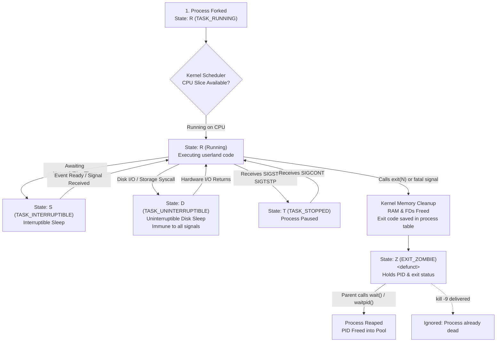

# Day 2: Linux Process Termination, Signals & Lifecycle States

Personal study notes and terminal labs covering Linux process termination mechanics: 8-bit exit code boundaries, parent wait and reaping cycles, zombie process accumulation and PID table exhaustion, signal delivery and handling semantics (catch, ignore, default), process probing via `kill -0`, CFS niceness priority, kernel process states (`R`, `S`, `D`, `Z`, `T`), and `/proc` state inspection.

---

# Part 1: What I Learnt Today

## Process Termination
* Exit status values:
  * 0: Perfect / success
  * 1 to 255: Failure / Error
* Whenever a process finishes running, it gives the operating system an exit code or return code `[exit(N)]`.
* Linux stores the latest exit codes in a special temp variable `$?`.
* The kernel wipes the process from RAM and saves that integer N in the process table.
* Exit codes are 8-bit. That means valid exit codes only range from 0 to 255.
* Waiting: The parent process pauses until its child finishes.
* Reaping: Parent collects the child's exit code so the system can delete it completely.
* Without reaping, the child stays stuck as a zombie.
* Server runs out of PID -> system crash.
* Zombie process cannot execute and takes no space in storage/RAM, but a minimal process table entry remains.

---

## Signals
* A simple notification sent to a process to trigger an action (stop, pause, exit).
* Common sources:
  * Keyboard:
    * Ctrl + C -> SIGINT (stop)
    * Ctrl + Z -> SIGTSTP (pause)
  * Kernel:
    * SIGSEGV (crash)
  * Other process / user command
* 3 ways a process can react to a signal:
  * Doing the system default (terminates)
  * Ignore the signal and keep running
  * Catch: Run custom code and then exit
* SIGKILL and SIGSTOP cannot be blocked, caught, defaulted, or ignored.
* `kill` is the same as `kill -TERM`.
* `kill 0` can be used to check permission without delivering a real signal:
  * A successful result means the PID exists and signaling is permitted at that instant.
  * Failure means the process might not exist or the user might not have permission.

---

## Niceness
* Ranges from -20 to 19, default = 0.
* High number = low priority.
* Low number = high priority.
* Nice value can be viewed using the `top` command in the `NI` column.
* Commands:
  * To start a program with a nice value: `nice -n 5 ...`
  * To change an already existing nice value: `renice -n 10 -p [PID]`

---

## Process States
* State codes:
  * R (running): Actively running
  * S (sleeping): Normal idle state
  * D (Disk/sleep): Waiting on storage until hardware responds
  * Z (zombie): A dead process
  * T (stopped): Process has been paused
* Diagnosis:
  * S = Healthy
  * D = Storage / hardware issue
  * Lots of Z = Parent has a bug

---

## /proc
* `/proc` is a virtual filesystem created in RAM by the kernel.
* Takes 0 bytes of disk space.
* Raw data source for commands like `ps` and `top`.

---

## Process Termination & State Transitions



---

# Part 2: What I Did Today (Labs & Verification)

### Lab 1: 8-Bit Exit Code Truncation & Signal Exit Values
Script: [`lab/exit_code_rollover.sh`](./lab/exit_code_rollover.sh)

```console
$ ./lab/exit_code_rollover.sh
==================================================
   LAB 1: EXIT STATUS CODES & 8-BIT ROLLOVER      
==================================================
[1] Testing Standard and Boundary Exit Codes:
Input: 0      | Description: Success / Clean termination    | Stored in $?: 0
Input: 1      | Description: Standard error / Catch-all     | Stored in $?: 1
Input: 42     | Description: Arbitrary user error           | Stored in $?: 42
Input: 255    | Description: Maximum 8-bit value            | Stored in $?: 255

[2] Testing 8-Bit Overflow / Rollover:
Input: 256    | Description: Overflow (256 mod 256 = 0)     | Stored in $?: 0
Input: 257    | Description: Overflow (257 mod 256 = 1)     | Stored in $?: 1
Input: 300    | Description: Overflow (300 mod 256 = 44)    | Stored in $?: 44
Input: -1     | Description: Negative integer (-1 mod 256 = 255) | Stored in $?: 255

[3] Testing Signal-Induced Termination Exit Codes (128 + N convention):
Signal: SIGHUP   (Signal 1 ) | Expected: 128 + 1  = 129 | Actual $?: 129
Signal: SIGINT   (Signal 2 ) | Expected: 128 + 2  = 130 | Actual $?: 130
Signal: SIGKILL  (Signal 9 ) | Expected: 128 + 9  = 137 | Actual $?: 137
Signal: SIGTERM  (Signal 15) | Expected: 128 + 15 = 143 | Actual $?: 143
```

**What this showed:**
* Exit codes strictly wrap modulo 256. Passing `256` results in `$? == 0`, turning a failure into a false success.
* Negative values like `-1` map to `255` via two's complement 8-bit unsigned conversion.
* Shell processes terminated by signals return an exit status matching the formula `128 + signal_number` (`SIGKILL` is 137, `SIGTERM` is 143, `SIGINT` is 130).

---

### Lab 2: Zombie Creation, Process Table Persistence, and Reaping
Script: [`lab/zombie_lifecycle.py`](./lab/zombie_lifecycle.py)

```console
$ python3 lab/zombie_lifecycle.py
==================================================
   LAB 2: ZOMBIE PROCESS LIFECYCLE & REAPING      
==================================================
[*] Parent Process PID: 512
[*] [Parent: 512] Forked Child PID: 513
[*] [Parent: 512] Intentionally sleeping for 2 seconds without calling wait()...
[+] [Child:  513] Spawned with PPID 512. Exiting immediately with status 42...

--- Reading /proc/513/status while child is un-reaped ---
Name:	python3
State:	Z (zombie)
Pid:	513
PPid:	512

--- Process table view (ps) ---
    PID    PPID STAT CMD
    513     512 Z+   [python3] <defunct>

[*] [Parent: 512] Attempting to kill Zombie (513) using SIGKILL (kill -9)...
[-] [Parent: 512] Signal delivered, but checking process state:
    PID    PPID STAT CMD
    513     512 Z+   [python3] <defunct>
[!] Notice: State is still 'Z'. A dead process cannot be killed.

[*] [Parent: 512] Reaping child via os.waitpid(513, 0)...
[+] [Parent: 512] Successfully reaped PID 513 with Exit Code: 42
[*] [Parent: 512] Does /proc/513 exist? False
==================================================
```

**What this showed:**
* When the child terminated with `exit(42)`, its status in `/proc/513/status` and `ps` immediately shifted to `State: Z (zombie)` / `<defunct>`.
* Delivering `SIGKILL` (`kill -9`) to the zombie had zero effect on the process table entry; the zombie remained in state `Z`.
* The moment the parent called `os.waitpid(513, 0)`, the exit status `42` was retrieved, and the kernel instantly erased `/proc/513` from the system.

---

### Lab 3: Signal Handling Matrix & Zero-Signal Probing
Script: [`lab/signal_matrix.py`](./lab/signal_matrix.py)

```console
$ python3 lab/signal_matrix.py
==================================================
   LAB 3: SIGNAL HANDLING MATRIX (PID: 518)   
==================================================

[1] Testing Signal Catching (SIGINT / SIGTERM):
Registered custom_handler for SIGTERM (15).

[2] Testing Signal Ignoring (SIGUSR1):
Configured SIGUSR1 (10) to SIG_IGN (Ignore).
Sending SIGUSR1 to self (518)...
Process survived SIGUSR1 without interruption.

[3] Testing Uncatchable Signals (SIGKILL & SIGSTOP):
Caught expected error attempting to trap SIGKILL (9): [Errno 22] Invalid argument
Caught expected error attempting to trap SIGSTOP (19): [Errno 22] Invalid argument

[4] Testing Process Probing via kill -0 (Signal 0):
Probe self (PID: 518): Exists = True -> Process exists and signaling is permitted
Probe non-existent (PID: 999999): Exists = False -> Process does not exist (ESRCH)

[5] Triggering graceful exit via SIGTERM to self:
[!] [Caught] Received SIGTERM (15). Executing cleanup before shutdown...
[!] [Cleanup] Flushing buffers, closing connections, saving state.
```

**What this showed:**
* `SIGUSR1` was ignored completely with `SIG_IGN`, allowing the process to continue running normally without interruption.
* Registering custom handlers for `SIGKILL` (9) or `SIGSTOP` (19) was rejected by the kernel with `EINVAL` (`[Errno 22] Invalid argument`).
* Signal 0 (`kill -0`) accurately verified that PID 518 exists without delivering an interrupt, and flagged non-existent PID 999999 with `ESRCH`.
* Sending `SIGTERM` triggered the custom handler, executing cleanup routines before terminating.

---

### Lab 4: Niceness, Priority Manipulation, and State Transitions
Script: [`lab/niceness_and_states.sh`](./lab/niceness_and_states.sh)

```console
$ ./lab/niceness_and_states.sh
==================================================
   LAB 4: PROCESS NICENESS & STATE TRANSITIONS    
==================================================
[1] Starting background worker with nice -n 10:
Worker started with PID: 534

[2] Process priority in ps:
    PID  NI PRI STAT COMMAND
    534  10   9 SN+  sleep

[3] Raw nice value in /proc/534/stat:
PID: 534 | Comm: (sleep) | State: S | Priority: 30 | Nice: 10

[4] Lowering priority further with renice -n 15:
534 (process ID) old priority 10, new priority 15
    PID  NI PRI STAT COMMAND
    534  15   4 SN+  sleep

[5] Sending SIGSTOP to pause process (State T):
    PID  NI PRI STAT WCHAN                COMMAND
    534  15   4 TN+  do_signal_stop       sleep

[6] Sending SIGCONT to resume process:
    PID  NI PRI STAT WCHAN                COMMAND
    534  15   4 SN+  do_sys_restart_sysca sleep

[*] Worker process 534 reaped and cleaned up.
==================================================
```

**What this showed:**
* Starting with `nice -n 10` gave the worker `NI: 10` and modified its priority to `PRI: 9` in `ps` and `Priority: 30` in `/proc/534/stat`.
* Calling `renice -n 15` dynamically lowered its priority without restarting the process (`NI: 15`).
* Sending `SIGSTOP` immediately shifted process state to `T` (stopped) and locked its kernel wait channel (`WCHAN`) into `do_signal_stop`.
* Sending `SIGCONT` resumed execution into state `S` (`WCHAN: do_sys_restart_sysca`) without losing process state.
